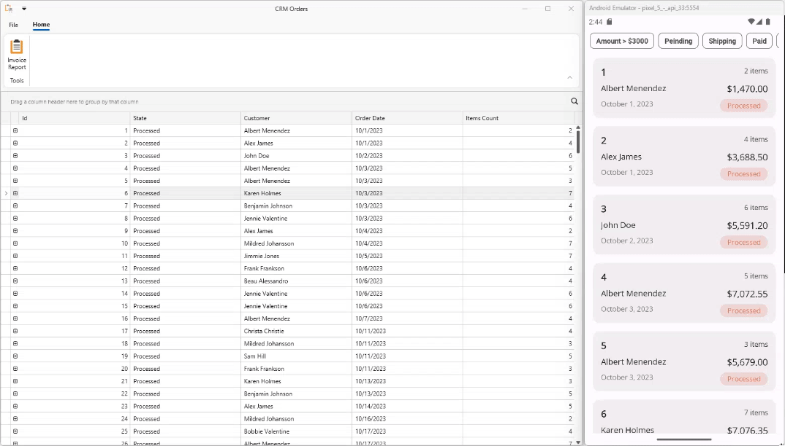
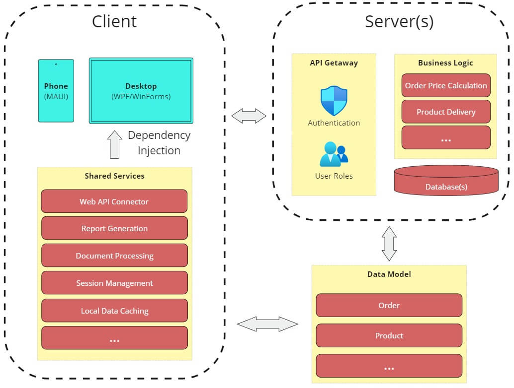

<!-- default badges list -->
[](https://supportcenter.devexpress.com/ticket/details/T1230298)
[](https://docs.devexpress.com/GeneralInformation/403183)
<!-- default badges end -->

# WPF & .NET MAUI - How to Share Code Between Desktop and Mobile Projects

In this example, we use DevExpress WPF and .NET MAUI component to create a desktop and mobile application with a shared codebase. The application displays orders loaded from a Web API and allows users to generate a report.



## Run Project

1. Start the WebApiService project without debugging.
2. Start the DesktopClient or MobileClient projects.

## Implementation Details

The general architecture is demonstrated on the following image:


The application includes the following projects:
- **Client.Shared**. Client-side services, common helpers.
- **DataModel**. A model for database objects.
- **DesktopClient**. A WPF application.
- **MobileClient**. A .NET MAUI application
- **WebApiService**. A web service that handles access to a database.

> **Note**:
> Although this example doesn't include authentication and role-based data access, you can generate a project with this functionality using the free [DevExpress Web API Service](https://www.devexpress.com/products/net/application_framework/security-web-api-service.xml).

### Shared Client Classes

Desktop and mobile clients reuse the following classes:
- OrderDataService. Incorporates logic to communicate with the Web API service.
- ReportService. Generates a report based on a selected order.

We use [Dependency Injection](https://community.devexpress.com/blogs/wpf/archive/2022/02/07/dependency-injection-in-a-wpf-mvvm-application.aspx) to introduce these services into desktop and mobile projects.

WPF:
```cs
protected override void OnStartup(StartupEventArgs e) {
    base.OnStartup(e);
    var builder = new ContainerBuilder();
    builder.RegisterSource(new AnyConcreteTypeNotAlreadyRegisteredSource());
    builder.RegisterType<ReportService>().As<IReportService>().SingleInstance();
    builder.RegisterInstance<IOrderDataService>(new OrderDataService(new HttpClient() {
        BaseAddress = new Uri("https://localhost:7033/"),
        Timeout = new TimeSpan(0, 0, 10)
    }));
    IContainer container = builder.Build();
    DISource.Resolver = (type) =>
    {
        return container.Resolve(type);
    };
}
```

.NET MAUI:
```cs
public static MauiAppBuilder RegisterViewModels(this MauiAppBuilder mauiAppBuilder) {
    mauiAppBuilder.Services.AddTransient<OrdersViewModel>();
    mauiAppBuilder.Services.AddTransient<InvoicePreviewViewModel>();
    return mauiAppBuilder;
}
public static MauiAppBuilder RegisterViews(this MauiAppBuilder mauiAppBuilder) {
    mauiAppBuilder.Services.AddTransient<OrdersPage>();
    mauiAppBuilder.Services.AddTransient<InvoiceReportPreviewPage>();
    return mauiAppBuilder;
}
public static MauiAppBuilder RegisterAppServices(this MauiAppBuilder mauiAppBuilder) {
    mauiAppBuilder.Services.AddTransient<IOrderDataService>(sp => new OrderDataService(new HttpClient(MyHttpMessageHandler.GetMessageHandler()) {
        BaseAddress = new Uri(ON.Platform(android: "https://10.0.2.2:7033/", iOS: "https://localhost:7033/")),
        Timeout = new TimeSpan(0, 0, 10)
    })); ;
    mauiAppBuilder.Services.AddTransient<IReportService, ReportService>();
    mauiAppBuilder.Services.AddTransient<INavigationService, NavigationService>();
    return mauiAppBuilder;
}
```

### Shared Web API Service

The Web API service includes basic endpoints to retrieve orders from a database connected with Entity Framework Core:
```cs
public class OrdersController : ControllerBase {
    //...
    [HttpGet]
    public async Task<ActionResult<IEnumerable<Order>>> GetOrders() {
        return await _context.Orders.Include(order => order.Customer)
            .Include(order => order.Items)
            .ThenInclude(orderItem => orderItem.Product)
            .ToListAsync();
    }
}
```

### Shared Model

Both client and server sides use the same model to work with business objects.

```cs
public class Customer {
    //...
}
public class Order {
    //...
}
public class Product {
    //...
}
```


## Files to Review

- [OrderDataService.cs](./CS/Client.Shared/OrderDataService.cs)
- [ReportService.cs](./CS/Client.Shared/ReportService.cs)
- [OrdersController.cs](./CS/WebApiService/Controllers/OrdersController.cs)
- [DesktopClient/App.xaml.cs](./CS/DesktopClient/App.xaml.cs)
- [MobileClient/MauiProgram.cs](./CS/MobileClient/MauiProgram.cs)

## Documentation

- [Get Started with DevExpress Controls for .NET Multi-platform App UI](https://docs.devexpress.com/MAUI/403249/get-started/get-started)
- [Get Started with DevExpress WPF Controls](https://docs.devexpress.com/WPF/401166/dotnet-core-support/getting-started)


## More Examples

- [DevExpress Mobile UI for .NET MAUI](https://github.com/DevExpress-Examples/maui-demo-app)
- [DevExpress Stocks App for .NET MAUI](https://github.com/DevExpress-Examples/maui-stocks-mini)
